# 安裝
[應該是使用這個](https://console.cloud.google.com/sql/instances?_ga=2.7677234.-1840286601.1719367844&project=chrome-era-427602-k6)

#  步驟(尚未摸好)
1. 先建立執行個體，此為SQL特化
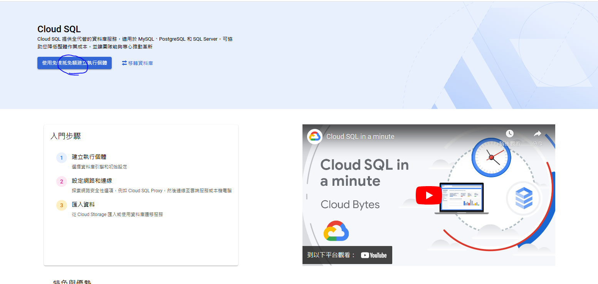
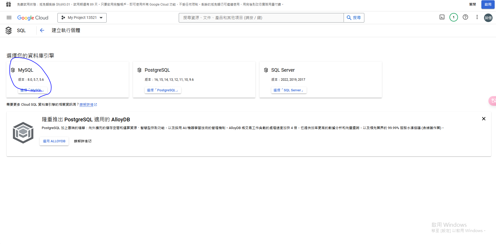
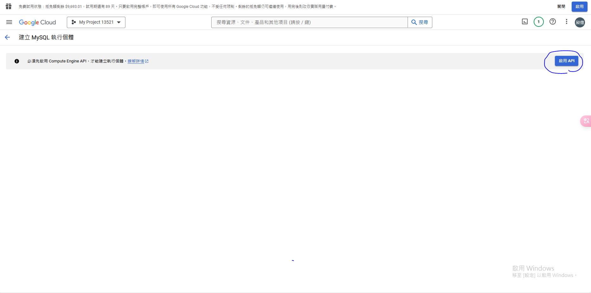

2. 再設定SQL(設定連線、設定使用者)
3. 存取(加密)

# 執行個體 ->跟TWCC一樣沒有用也要收錢
1. 最便宜一天只要九塊，不知道會不會超載，如果真的可以這麼便宜那其實可以用
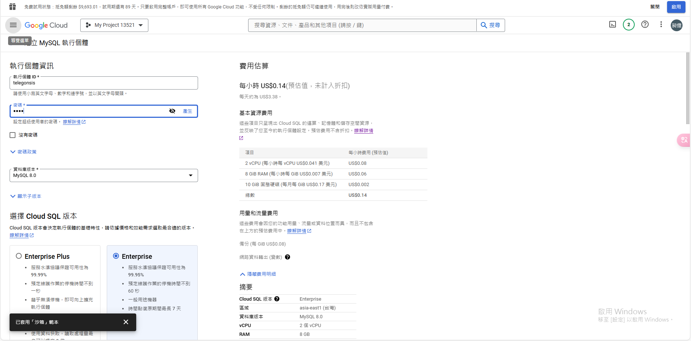
2. 設名字密碼 (itri) 這個是整個個體的蜜，可能是sudo要用的(不懂)
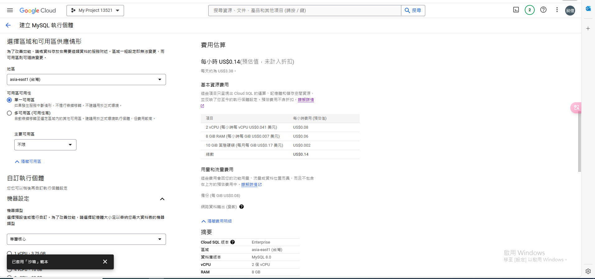
3. 建立執行個體等等
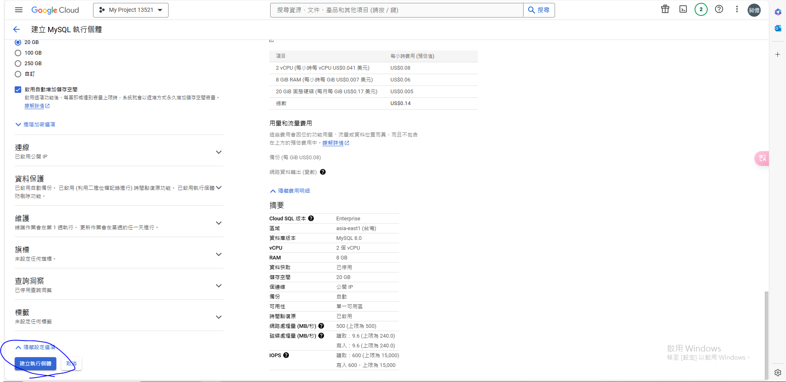
4. 獲得個體(建不錯久)
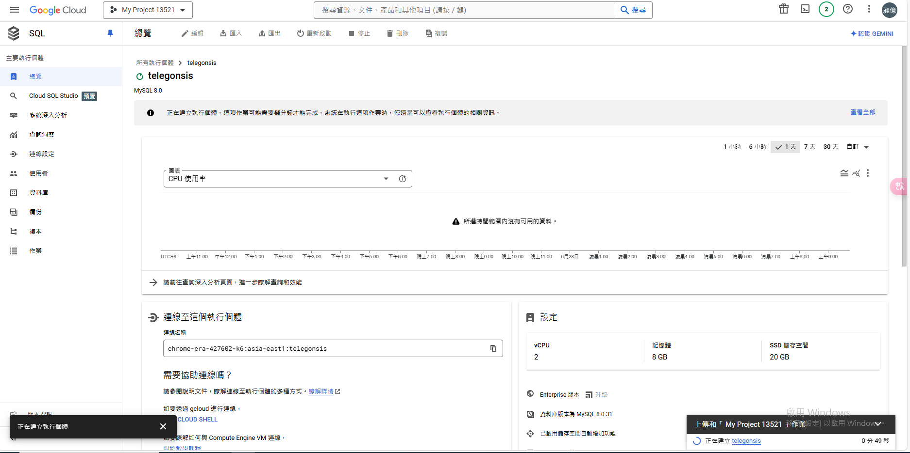

# 設定使用者

1. 可以根據使用者給權限
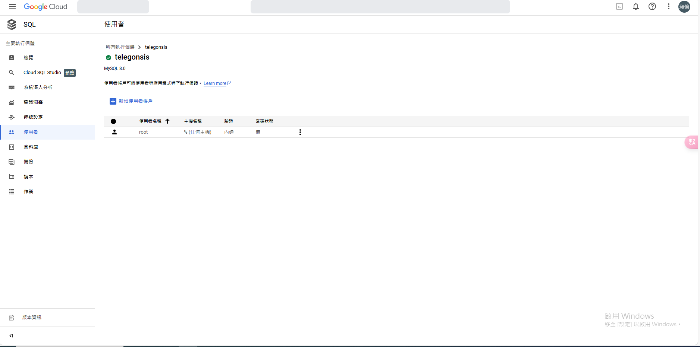
2. 避免用root，感覺就安全很多(tele, tele)
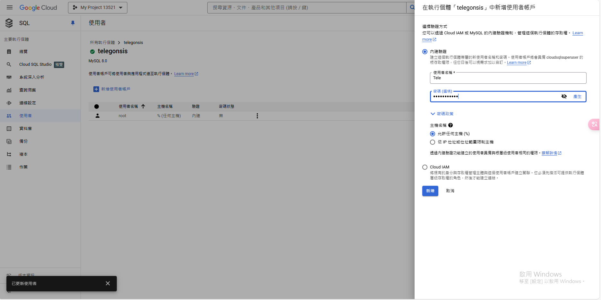
3. 查看表
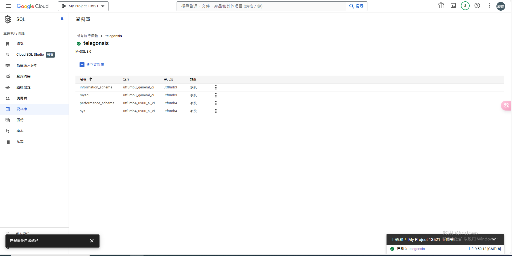

# 設定連線，重要重要重要
1. [請查看自己的對外IP](https://magiclen.org/check-ip/)
2. 把他打到網路上面
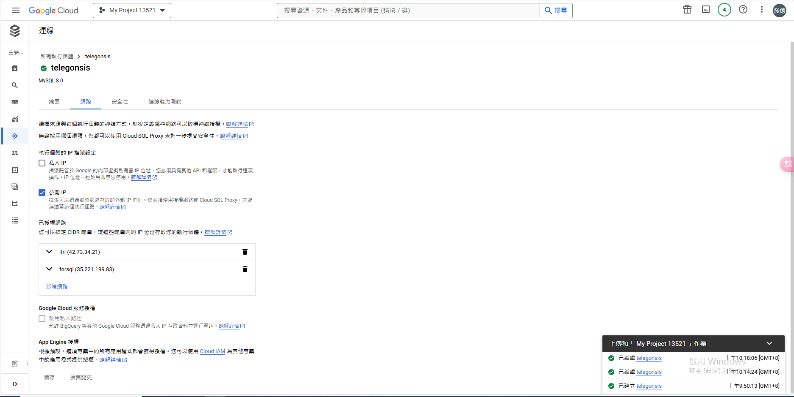

# SSL加密的話，好像比較安全，反正就三個檔案，也沒有很麻煩，而且不會被盜
```python

import pymysql.cursors

# MySQL 连接信息
mysql_host = 'your_mysql_host'
mysql_port = 3306  # MySQL 默认端口
mysql_user = 'your_mysql_user'
mysql_password = 'your_mysql_password'
mysql_db = 'your_mysql_database'

# SSL 相关文件路径
ssl_ca = '/path/to/ca-cert.pem'
ssl_cert = '/path/to/client-cert.pem'
ssl_key = '/path/to/client-key.pem'

# 连接 MySQL 数据库
conn = pymysql.connect(host=mysql_host,
                       port=mysql_port,
                       user=mysql_user,
                       password=mysql_password,
                       db=mysql_db,
                       cursorclass=pymysql.cursors.DictCursor,
                       ssl={'ca': ssl_ca, 'cert': ssl_cert, 'key': ssl_key})

# 执行 SQL 查询或操作
try:
    with conn.cursor() as cursor:
        sql_query = "SELECT * FROM your_table;"
        cursor.execute(sql_query)
        result = cursor.fetchall()
        print(result)
finally:
    conn.close()

```

# 用pysql workbench就可以存取了
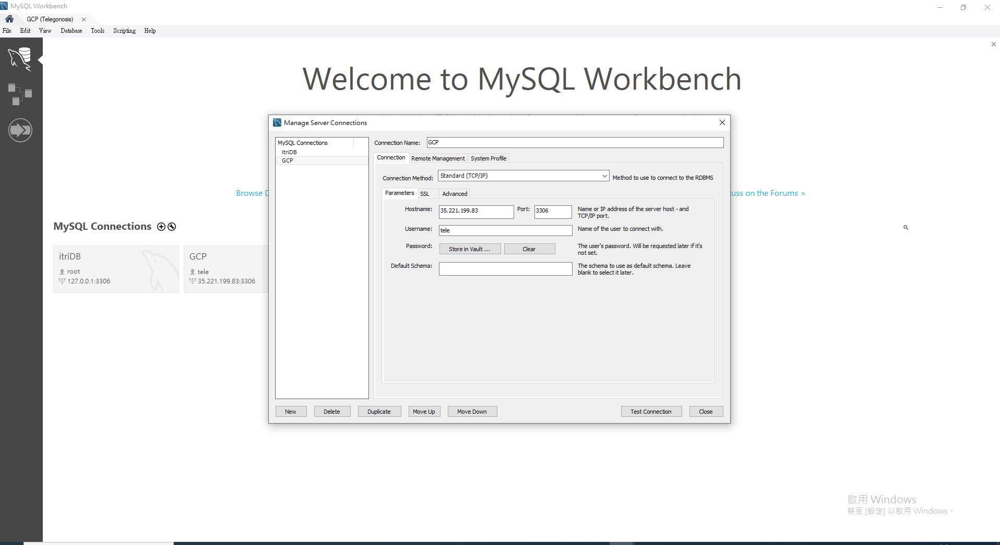